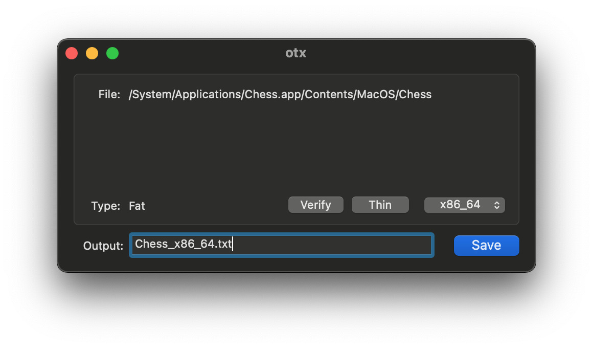

otx
===

      

otool eXtended: Mach-O disassembler.

Description
-----------

This version is compatible with macOS 11 Big Sur.

Following changes has been made:

* Based on macOS 12 SDK.
* 64bit binary.
* Works with otool's llvm disassembly.
* Source code compatible with Xcode 12+.
* Support for Dark Mode.
* Bug fixes & quality of life improvements.
* Compatible with macOS Big Sur.
* Intel Only!

Changelog
---------

Build 1:

* Fixed wrong arch type being selected by default.
* Updated to work with default llvm disassembler.
* Support for Dark Mode.
* Added Preference Option for Showing leading '0x' address.